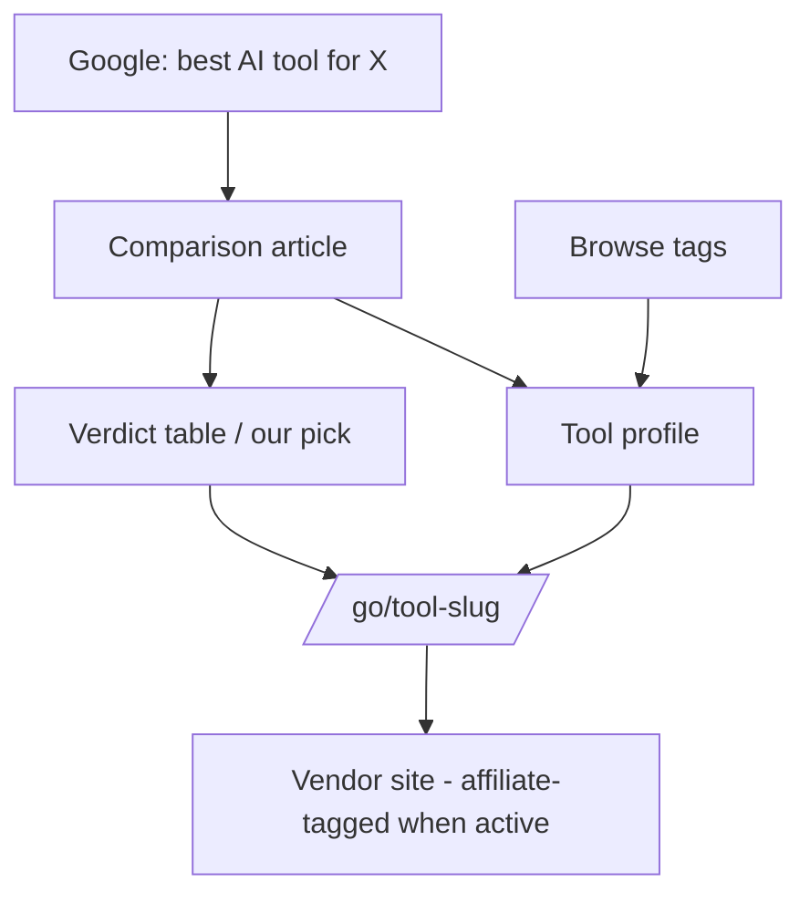
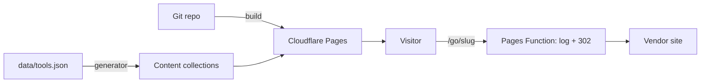

# PRD: ai-tools-affiliate

*Produced by masterplan. Every section is a decision with a rationale — nothing here is open for re-litigation during the build (see §20 for choices that might look like mistakes). Version: §22.*

## 1. Summary & problem

A curated AI-tools review site that earns affiliate commissions. People trying to pick the right AI tool for a concrete job currently get scraped directories with no opinion or SEO spam; this site gives them a hands-on comparison ("best AI tool for X") with a ranked verdict and a tracked outbound link to the winner. The one-shot build delivers the **machine** — site, schemas, redirect layer, content pipeline — with owner-verified tool facts and affiliate IDs as swappable inputs; the agent never invents tool facts.

## 2. Prior-art & differentiation

| Product | What it does | What we absorb | License |
|---|---|---|---|
| Futurepedia | ~4,000-tool AI directory; affiliate + premium listings | Tool-card grid, category browsing pattern | Proprietary (pattern only) |
| There's An AI For That / Toolify | Breadth-first AI directories | Proof the affiliate model works at scale | Proprietary (pattern only) |
| minted-directory-astro | Open-source markdown-driven directory template (Astro + Tailwind; search, tags, listings, sponsored slots) | Codebase — the site is built by adapting it | MIT |
| Wirecutter | Editorial product reviews with verdict boxes | Comparison-article format: ranked verdict table, "our pick" box | Proprietary (pattern only) |

**The one difference:** editorial depth over breadth — ~50 hands-on-tested tools with per-job verdicts backed by owner-verified data, versus scraped thousands with no opinion. The project's main ongoing effort is content, not code.

## 3. Target users & business model

First user: a solo maker or small-business owner choosing an AI tool for one concrete job (high purchase intent, arrives from Google). Launch scale: hundreds of visitors/day is success in month one. Revenue: affiliate commissions only. **Owner budget: ~$0–10/month** — domain cost only; every infrastructure choice below fits free tiers.

## 4. Features

### 4.1 Comparison articles (core)
**What:** "Best AI tool for ⟨job⟩" articles: intro, ranked verdict table (rank badge, tool, one-line verdict, price, per-row CTA), "our pick" summary box, per-tool sections, FTC disclosure above the fold.
**Acceptance criteria:**
- [ ] Article layout renders the verdict table and "our pick" box from structured frontmatter (not hand-written HTML per article)
- [ ] Every CTA routes through `/go/<tool-slug>` — no direct vendor URLs in content
- [ ] Disclosure component visible above the fold on every article
- [ ] `lastReviewed` date rendered on the page

### 4.2 Tool profile pages (core)
**What:** one page per tool generated from `data/tools.json`: what it does, verified pricing, verdict summary, jobs it wins, CTA.
**Acceptance criteria:**
- [ ] Pages are generated from `tools.json` — adding a tool entry produces a page with zero code changes
- [ ] `affiliateStatus` (`none` / `applied` / `active`) stored per tool; CTA renders regardless, via `/go/`
- [ ] Profile shows `lastReviewed` and pricing "verified on ⟨date⟩"

### 4.3 Redirect & measurement layer (core)
**What:** `/go/<tool-slug>` outbound indirection via Cloudflare Pages `_redirects`, generated from `tools.json`; a Pages Function logs clicks (slug, referrer path, timestamp) before redirecting.
**Acceptance criteria:**
- [ ] `/go/<slug>` 302s to the tool's current URL (vendor URL until affiliate approval, then affiliate URL) — swapping is a one-line data change
- [ ] Clicks are logged and queryable (Pages Function + Workers Analytics Engine or log tail)
- [ ] Unknown slug → 404, not a broken redirect

### 4.4 Browse & search (secondary)
**What:** tag/category browsing and client-side search — both inherited from the template.
**Acceptance criteria:**
- [ ] Search returns tool profiles and articles; zero-results state exists
- [ ] Tag pages list matching tools; empty-tag state exists

### 4.5 Content pipeline (core)
**What:** a generator script that produces article/profile markdown from `data/tools.json` + per-article verdict data, validated against the content-collection schema.
**Acceptance criteria:**
- [ ] Zod content-collection schemas are defined and every generated file validates at build
- [ ] Seed batch generated: **5 comparison articles + 15 tool profiles** from seed data (scaling to 20/50 is post-launch content work, not build work)
- [ ] The generator rejects entries missing verified facts (price, URL, verdict) rather than inventing them

## 5. User flows



Success end-state: outbound click through `/go/` logged.

## 6. Pages & screens

| Page | Route | Components | Notes |
|---|---|---|---|
| Home | `/` | Hero, featured comparisons, tool grid, tag nav | Template layout, re-copied |
| Comparison article | `/best/<slug>` | Disclosure, verdict table, our-pick box, tool sections, CTAs | New layout (Wirecutter pattern) |
| Tool profile | `/tools/<slug>` | Facts card, verdict summary, CTA, lastReviewed | Generated from tools.json |
| Tag page | `/tags/<tag>` | Filtered tool grid, empty state | Template built-in |
| Search | `/search` | Client-side search, zero-results state | Template built-in |
| About / Privacy / Terms | `/about` `/privacy` `/terms` | Static prose, owner identity | Required for affiliate approval |
| 404 | `*` | Link back to home + search | |

## 7. Data model

No database. Content is files:

```
data/tools.json          ← single source of truth for tool facts (owner-verified)
src/content/comparisons/ ← article markdown (generated + hand-edited)
src/content/tools/       ← profile markdown (generated from tools.json)
```

`tools.json` entry schema (mirrored as zod in the content config):

```json
{
  "slug": "example-tool",
  "name": "Example Tool",
  "url": "https://example.com",
  "affiliateUrl": null,
  "affiliateStatus": "none",
  "category": "writing",
  "tags": ["copywriting", "seo"],
  "pricing": { "model": "subscription", "from": "$19/mo", "verifiedOn": "2026-07-03" },
  "verdict": "Best for long-form SEO drafts; weak editor.",
  "lastReviewed": "2026-07-03"
}
```

## 8. API contracts

One serverless function:

```
GET /go/:slug
Behavior: log { slug, referrer, ts } → 302 to affiliateUrl ?? url
Errors:   unknown slug → 404 page
```

No other backend surface.

## 9. External integrations & AI roles

| Service | Role | Tier | Monthly cost | Verified |
|---|---|---|---|---|
| Cloudflare Pages (+ Functions) | Hosting, redirects, click log | Free | $0 | 2026-07-03 |
| Cloudflare Web Analytics | Page analytics | Free | $0 | 2026-07-03 — Plausible rejected: no free tier |
| Affiliate programs (Impact, PartnerStack, per-vendor) | Revenue | n/a — publisher approval required, post-launch | $0 | Enrollment is a post-launch owner task; §4.3 decouples it |
| Domain registrar | Domain | — | ~$1/mo amortized | — |

**AI's role in the product:** drafting prose *around* owner-verified facts during content scaling (post-launch). AI never generates tool facts, pricing, or verdicts — the generator enforces this (§4.5).

## 10. Tech stack

| Layer | Choice | Why |
|---|---|---|
| Framework | Astro 4 + Tailwind | Inherited from the adapted template; static-first fits the product exactly |
| Content | Astro content collections + zod | Schema validation is the guardrail the red team demanded |
| Search | Template's client-side search | Zero infra |
| Functions | Cloudflare Pages Functions | Only dynamic piece (`/go/` logging), free tier |
| Repo | Closed git repo | Commercial fate (§21); MIT template is compatible |

## 11. Architecture

Fully static site + one edge function.



Stateless everywhere; the click log is append-only analytics, not application state.

## 12. Security

Static site: no auth, no user data, no forms at launch. Requirements: no secrets in the repo (affiliate IDs live in `tools.json` which is data, not secret; Cloudflare tokens only in local env / CI, `.env.example` documents them); dependencies from the template audited at adaptation time (`npm audit` clean or exceptions noted); HTTPS enforced by Pages. Privacy surface: `/privacy` states analytics + click logging honestly (no cookies needed — Cloudflare Web Analytics is cookieless).

## 13. Deployment & infrastructure

Cloudflare Pages, git-push deploy from the repo's main branch. Custom domain + TLS via Cloudflare. Backups: the git repo is the backup (content is files). **Monthly total: $0 + domain (~$10/yr)** — inside the §3 budget.

## 14. Component reference map

| Component | Reference | License | Absorb |
|---|---|---|---|
| Site base (listings, tags, search, cards) | github.com/masterkram/minted-directory-astro | MIT | Code — adapt directly |
| Comparison article: verdict table + "our pick" box | Wirecutter review pages | Proprietary | Pattern only — re-implement |
| Tool card grid & category nav | Futurepedia | Proprietary | Pattern only |
| `/go/` redirect + click log | Cloudflare Pages `_redirects` + Functions docs | Platform docs | Standard platform pattern |

## 15. Design direction

- **Register:** product — calm, credible, editorial. Not a hype site.
- **Mood:** trustworthy, clean, fast, opinionated.
- **Look references:** Wirecutter (editorial authority), Futurepedia (clean tool grid).
- **Must NOT look like:** an AI-generated affiliate spam blog — no stock-gradient hero, no fake urgency badges, no wall of ads. The design must make "a human actually tested this" legible.

## 16. Content & seed data

Day one (build deliverable): **5 comparison articles + 15 tool profiles**, generated by the pipeline from owner-verified seed data in `data/tools.json`. The owner supplies/verifies: pricing, tested verdict line, canonical URL per tool. Scaling to 20 articles / 50 profiles is post-launch content work using the same pipeline (§4.5) — explicitly not part of the one-shot build. Quality bar: no tool fact appears anywhere unless it exists in `tools.json`.

## 17. Required credentials

| Credential | Used by | Needed at milestone |
|---|---|---|
| Cloudflare account + Pages project | §13 deploy, §8 function | M7 — deploy |
| Domain (registrar access) | §13 | M7 — deploy |
| Affiliate program accounts | §4.3 URL swaps | Post-launch (not a build blocker by design) |

## 18. Build order

1. **M1 — Scaffold:** adapt minted-directory-astro; site runs locally with template demo content.
2. **M2 — Schemas & data:** `data/tools.json` format + zod content-collection schemas; build fails on invalid content (proven by a deliberate bad entry).
3. **M3 — Redirect layer:** `/go/<slug>` generation from tools.json + click-logging Pages Function; unknown slug → 404.
4. **M4 — Layouts:** tool profile page + comparison-article layout (verdict table, rank badges, per-row CTA, our-pick box, disclosure component, lastReviewed).
5. **M5 — Legal & SEO surface:** /about /privacy /terms, 404, empty states, sitemap.xml, robots.txt, canonical URLs, OG images, schema.org ItemList/Review on comparisons.
6. **M6 — Content pipeline + seed batch:** generator script; 5 articles + 15 profiles generated from seed data and validating.
7. **M7 — Deploy:** Cloudflare Pages live on the domain, analytics wired, `/go/` logging verified in production.
8. **M8 — Full QA pass:** every acceptance criterion in §4 verified with evidence; Lighthouse ≥90 performance / ≥95 SEO; layouts verified at 375px.

## 19. Non-goals

No user accounts. No tool-submission portal. No newsletter in v1. No auto-scraping of tool data. No sponsored-slot wiring at launch (template supports it; deliberately unconfigured — excluded from acceptance criteria). No CMS — content is git-based by design.

## 20. Considered and rejected

| Suggestion | Source | Why rejected |
|---|---|---|
| Email capture at launch | Validation 🟢 | Contradicts v1 non-goal "no newsletter"; revisit post-launch when there is traffic worth capturing |
| Plausible analytics | Phase 4 draft | No free tier (verified); Cloudflare Web Analytics is free and cookieless |
| Building the site from scratch | Phase 2 | minted-directory-astro (MIT) covers the directory base; custom work goes only where the product differs (comparison layout, /go/ layer, pipeline) |
| Agent-generated tool verdicts | Validation 🔴 | Fabricated hands-on claims destroy the product's entire differentiation; verdicts are owner-verified data |
| Real affiliate URLs at build time | Validation 🔴 | Programs approve live sites; the /go/ indirection makes them a post-launch data swap |

## 21. Product fate

Commercial personal project; closed repo. Implications: MIT attribution for the adapted template kept in the repo; docs are this package (no public docs); hardening = static-site level (§12); honest cookieless analytics disclosure.

## 22. Version & changelog

- **v1.0 — 2026-07-03 — initial** (post-validation: machine/content split, /go/ layer, legal surface, pipeline-capped seed batch)
