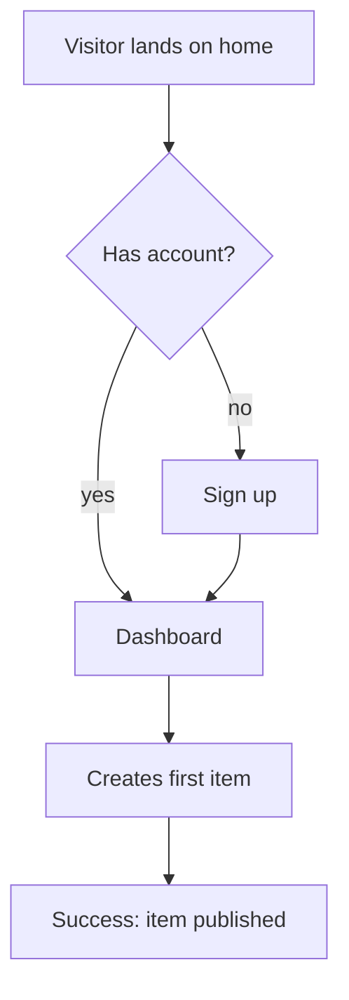
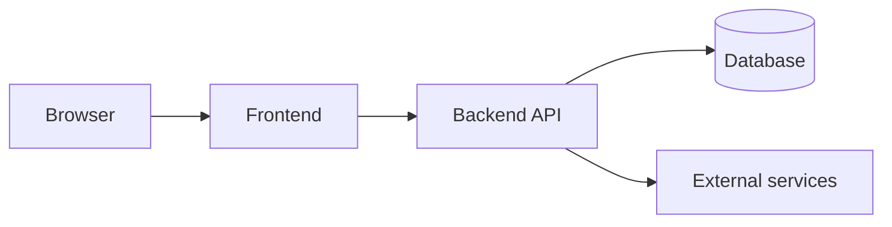

# PRD.md Template

Copy this structure into the package's `PRD.md` and fill every section. **Every section resolves to a DECISION with a short rationale. No option lists. No TBD.** If a section genuinely does not apply, keep the heading and write "Not applicable — ⟨reason⟩" so the executing agent knows it was considered, not forgotten. Scale depth to the project: a small tool gets short sections, a large app gets long ones.

---

## 1. Summary & problem

What this product is, the problem it solves, and for whom — a half page maximum. The confirmed pitch paragraph from phase 1 belongs here, refined.

## 2. Prior-art & differentiation

The evidence that this should exist. Table plus the single most important sentence in the document:

| Product | What it does | What we absorb | License |
|---|---|---|---|
| ExampleApp | Link-in-bio pages with analytics | Page-builder flow, pricing model | Proprietary (pattern only) |
| example-oss | Self-hosted link pages | Data model, deploy setup | MIT |

**The one difference:** ⟨exactly what makes this worth building instead of deploying the closest existing product⟩

## 3. Target users & business model

Who uses it (concrete persona, not "everyone"), how many at launch scale, and how it sustains itself: free / one-time / subscription / internal cost center. Include the owner's stated monthly budget for infrastructure and APIs — later sections must fit inside it.

## 4. Features

One block per feature. A feature without acceptance criteria does not exist.

### 4.1 ⟨Feature name⟩
**What it does:** one paragraph, concrete behavior.
**Priority:** core / secondary (core = the product is broken without it).
**Acceptance criteria:**
- [ ] ⟨observable, testable statement — "a visitor can submit the form and sees a confirmation within 2s"⟩
- [ ] ⟨…⟩

## 5. User flows

One mermaid diagram per primary flow, plus a sentence naming its start and success end-state.



## 6. Pages & screens

Inventory of every page/screen with its components — the executing agent builds exactly this list.

| Page | Route | Components | Notes |
|---|---|---|---|
| Home | `/` | Hero, feature grid, CTA, footer | Public |
| Dashboard | `/app` | Nav, item list, create button, empty state | Auth required |

Include empty, loading, and error states for pages that need them.

## 7. Data model

The actual schema, not "needs a database". Every table/collection, every field, every relation:

```sql
CREATE TABLE users (
    id          UUID PRIMARY KEY DEFAULT gen_random_uuid(),
    email       TEXT UNIQUE NOT NULL,
    created_at  TIMESTAMPTZ NOT NULL DEFAULT now()
);

CREATE TABLE items (
    id          UUID PRIMARY KEY DEFAULT gen_random_uuid(),
    user_id     UUID NOT NULL REFERENCES users(id) ON DELETE CASCADE,
    title       TEXT NOT NULL,
    status      TEXT NOT NULL DEFAULT 'draft' CHECK (status IN ('draft','published')),
    created_at  TIMESTAMPTZ NOT NULL DEFAULT now()
);
```

If the product has no persistent data, state that and why.

## 8. API contracts

Internal endpoints the frontend consumes — route, payload, response, error shape:

```
POST /api/items
Request:  { "title": "My first item" }
Response: 201 { "id": "…", "title": "My first item", "status": "draft" }
Errors:   401 unauthenticated · 422 { "error": "title required" }
```

## 9. External integrations & AI roles

Every third-party service and what it does here. Each entry verified alive during phase 4, with pricing at the expected volume:

| Service | Role | Plan/tier | Est. monthly cost | Verified on |
|---|---|---|---|---|
| ⟨payment provider⟩ | Checkout | Standard, 2.9% + fee | ~⟨amount⟩ | ⟨date⟩ |
| ⟨LLM API⟩ | Generates descriptions | Pay-as-you-go | ~⟨amount⟩ | ⟨date⟩ |

If AI is part of the product, specify exactly where it acts, which model tier, and the fallback when it fails.

## 10. Tech stack

The chosen stack — one choice per layer, with rationale tied to sections 3 and 9:

| Layer | Choice | Why |
|---|---|---|
| Frontend | ⟨framework⟩ | ⟨reason⟩ |
| Backend | ⟨framework/runtime⟩ | ⟨reason⟩ |
| Database | ⟨engine⟩ | ⟨reason⟩ |
| Hosting | ⟨platform⟩ | ⟨reason — must fit §3 budget⟩ |

## 11. Architecture

How the pieces connect — a short prose description plus a diagram:



Name the boundaries: what runs where, what talks to what, what is stateless.

## 12. Security

Concrete requirements, scaled to the product's fate (§21): auth mechanism, session/token handling, input validation strategy, secrets handling (env vars, never committed), rate limiting if public, data privacy obligations if user data is stored.

## 13. Deployment & infrastructure

Where it runs, how it ships, and what it costs: hosting target, deploy method (the executing agent must be able to perform it), domain/TLS, backups if there is a database, and the monthly total — which must fit the §3 budget.

## 14. Component reference map

The chimera map: each major component anchored to a proven implementation. Pattern = re-derive the approach; code = adapt with attribution (license permitting).

| Component | Reference (repo/product) | License | Absorb |
|---|---|---|---|
| ⟨e.g. drag-drop editor⟩ | ⟨repo URL⟩ | MIT | Code — adapt directly |
| ⟨e.g. onboarding flow⟩ | ⟨product⟩ | Proprietary | Pattern only |

## 15. Design direction

Prevents functionally-correct-but-generic output:

- **Register:** brand (expressive, marketing) or product (calm, workhorse UI) — pick per surface.
- **Mood:** 3–5 words ("warm, editorial, unhurried").
- **Look references:** 2–3 existing products whose visual quality is the bar.
- **Must NOT look like:** ⟨the failure mode — e.g. "a default component-library dashboard with stock gradients"⟩.

## 16. Content & seed data

What the product contains on day one so it ships alive, not as an empty shell: what content, from where (AI-generated / owner-provided / imported), and minimum quantities ("20 seeded articles", "5 example projects"). If the executing agent generates it, say so and set the quality bar.

## 17. Required credentials

Everything the owner must provide, and when the build needs it:

| Credential | Used by | Needed at milestone |
|---|---|---|
| ⟨API key⟩ | §9 integration | M4 — integrations |
| ⟨hosting token⟩ | §13 deploy | M7 — deploy |

## 18. Build order

The sequence STATUS.md mirrors — numbered milestones, each independently verifiable, ending with the full QA pass:

1. **M1 — Scaffold:** repo, stack, CI-less local run works.
2. **M2 — Data layer:** schema migrated, seed data loads.
3. **M⟨n⟩ — …**
4. **M⟨last⟩ — Full QA pass:** every acceptance criterion in §4 verified with evidence.

## 19. Non-goals

What is deliberately NOT built, so the executing agent doesn't helpfully add it: ⟨e.g. "no mobile app; no multi-language; no admin panel in v1"⟩.

## 20. Considered and rejected

Deliberate choices that might look like mistakes — from validation and interrogation — so nobody "fixes" them:

| Suggestion | Source | Why rejected |
|---|---|---|
| ⟨e.g. use a CMS⟩ | Validation 🟡 | ⟨reason⟩ |

## 21. Product fate

Open source / commercial / internal — and what that implies here: license choice, README/docs expectations, hardening level, telemetry stance.

## 22. Version & changelog

Maintained by revise mode. Bump minor for additive changes, major for changes to already-built behavior.

- **v1.0 — ⟨YYYY-MM-DD⟩ — initial**
